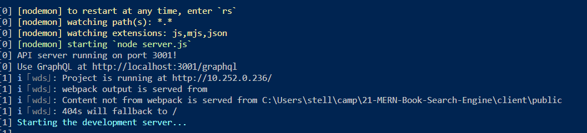
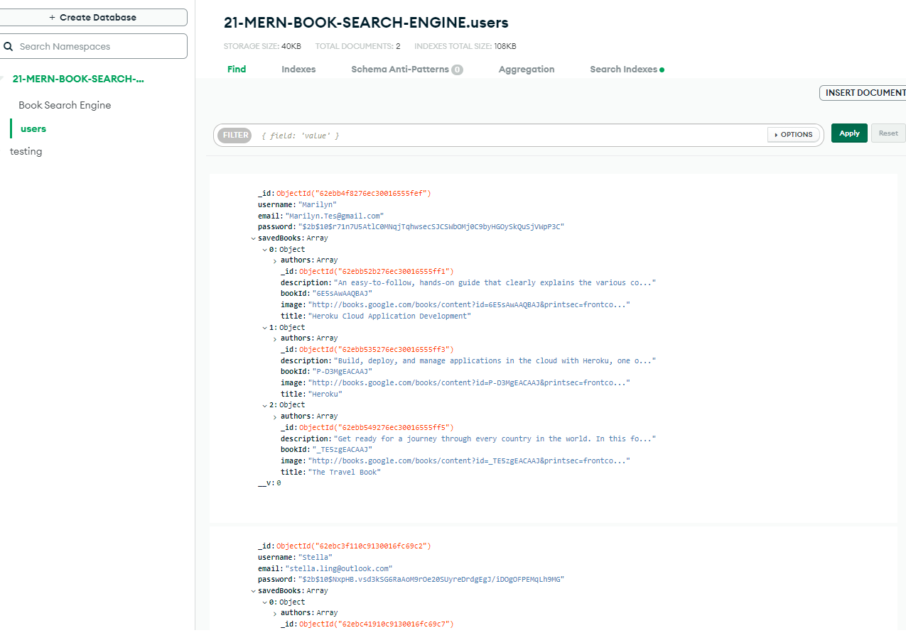
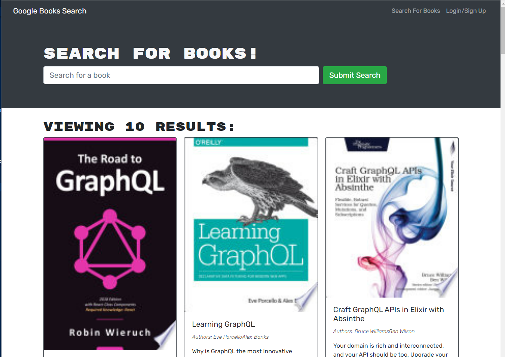
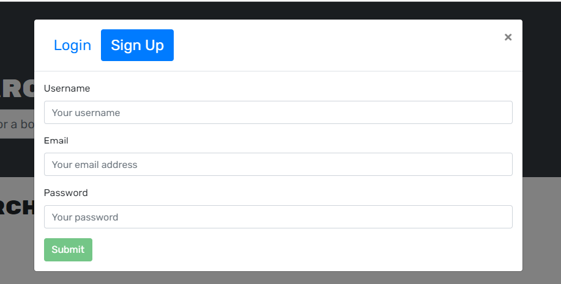
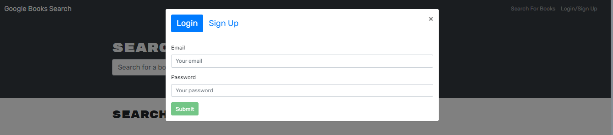
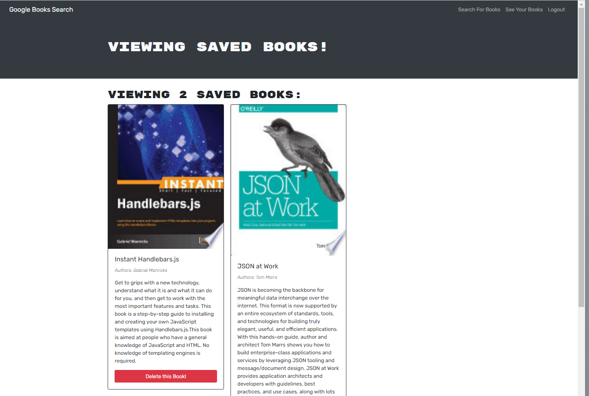
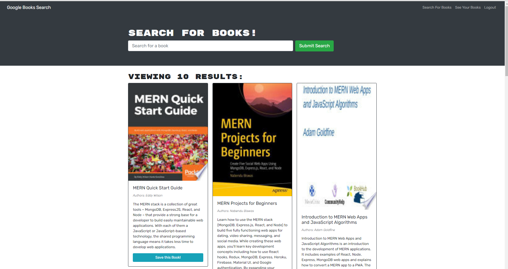
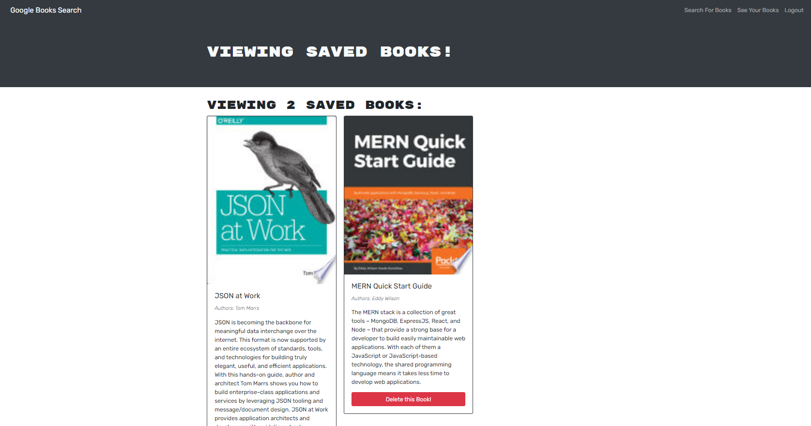
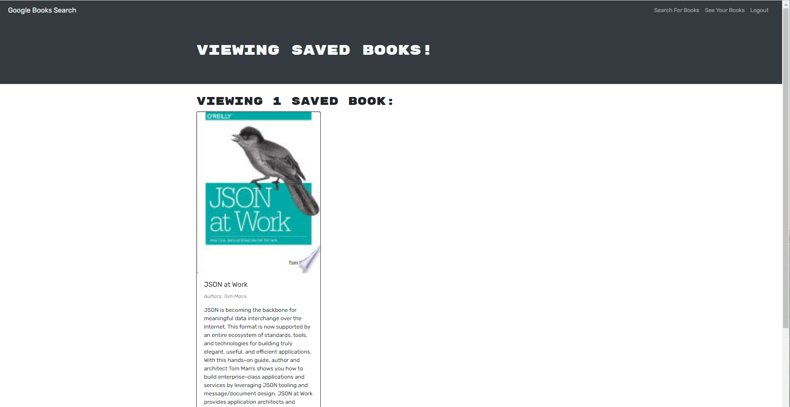
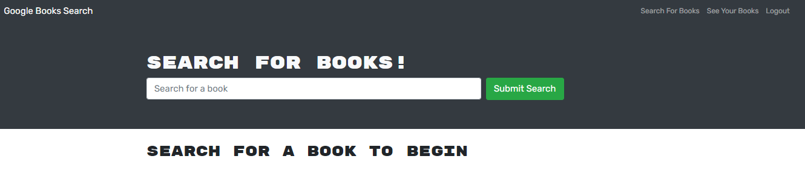

## 21 MERN: Book Search Engine

[](https://opensource.org/licenses/MIT)

## Description

This project is to take the starter code with a fully functioning Google Books API search engine built with a RESTful API, and refactor it to be a GraphQL API built with Apollo Server. The application was built using the MERN stack with a React front end, MongoDB database, Node.js, Express.js and API and was already set up to allow the users to save book searches to the back end.

This project assisgnment is to :-

- Set up an Apollo Server to use GraphQL queries and muations to fetch and modify data, replacing the existing RESTful API.
- Modify the existing authenication middleware so that it works in the context of a GraphQL API.
- Create an Apollo Provider so that requests can communicate with an Apollo Server.
- Deploy the application to Heroku with a MongoDB database using MongoDB Atlas.

The URL of the GitHub repository is https://github.com/stellalph/21-MERN-Book-Search-Engine.git and the repository name is 21-MERN-Book-Search-Engine.

## Table of Contents

- [Technologies Used](#technologies-used)
- [Deployment](#deployment)
- [Usage](#usage)
- [References](#references)
- [License](#license)

## Technologies Used

- This application is a MERN stack application which is a group of four technologies, that is:-
  - MongoDB
  - Express.js
  - ReactJS
  - Node.js
- The MERN stack has a three-layer architecture based on Model-View-Controller pattern and each interconnected layer performs a specific function in the application:-

  | Client (View)          | React JS                   | User inputs data and Data display                        |
  | ---------------------- | -------------------------- | -------------------------------------------------------- |
  | **Server(Controller)** | **Express.js and Node.js** | **Method called to store and retrieve data in database** |
  | **Database(Model)**    | **MongoDB**                | **Stores raw data and contains no logic**                |

- As this application has come already with mostly pre-installed npm packages and is fully functioning Google Books API search engine built with a RESTful API and to refactor it to be a Graph API built with Apollo Server, the following additional npm packages were installed:-

        - npm i apollo-server-express
        - npm i graphql
        - npm i @apollo/client
        - npm i @apollo/react-hooks

* Before deploying to Heroku, the application is run in develop mode and tested using by entering at command prompt:-

  - npm install (ensure all that dependencies are installed)
  - npm init
  - npm run develop ( cd to the correct directory)

    

## Deployment

- The application has been deployed to Heroku with a MongoDB database using MongoDB Atlas.

- See the below the example of MongoDB database using MongoDB Atlas:-

  

- The URL of the functional deployed application is https://protected-brushlands-99995.herokuapp.com/

## Usage

Below are the screenshots of the walkthrough steps the user (the avid reader) who want to search for new books to so that the user can keep a list of books to purchase.

- As the user of the application :-

```

GIVEN a book search engine
WHEN I load the search engine
THEN I am presented with a menu with the options Search for Books and Login/Signup and an input field to search for books and a submit button
WHEN I click on the Search for Books menu option
THEN I am presented with an input field to search for books and a submit button
WHEN I am not logged in and enter a search term in the input field and click the submit button
THEN I am presented with several search results, each featuring a book’s title, author, description, image, and a link to that book on the Google Books site
```

- 

```
WHEN I click on the Login/Signup menu option
THEN a modal appears on the screen with a toggle between the option to log in or sign up
WHEN the toggle is set to Signup
THEN I am presented with three inputs for a username, an email address, and a password, and a signup button

```

- 

```
WHEN the toggle is set to Login
THEN I am presented with two inputs for an email address and a password and login button

```

- 

```
WHEN I enter a valid email address and create a password and click on the signup button
THEN my user account is created and I am logged in to the site
WHEN I enter my account’s email address and password and click on the login button
THEN I the modal closes and I am logged in to the site
WHEN I am logged in to the site
THEN the menu options change to Search for Books, an option to see my saved books, and Logout
```

- 

```
WHEN I am logged in and enter a search term in the input field and click the submit button
THEN I am presented with several search results, each featuring a book’s title, author, description, image, and a link to that book on the Google Books site and a button to save a book to my account
```

- 

```
WHEN I click on the Save button on a book
THEN that book’s information is saved to my account
WHEN I click on the option to see my saved books
THEN I am presented with all of the books I have saved to my account, each featuring the book’s title, author, description, image, and a link to that book on the Google Books site and a button to remove a book from my account
```

- 

```
WHEN I click on the Remove button on a book
THEN that book is deleted from my saved books list
```

- 

```
WHEN I click on the Logout button
THEN I am logged out of the site and presented with a menu with the options Search for Books and Login/Signup and an input field to search for books and a submit button
```

- 

## References

- Request Response - The Full Stack Blog - Set up MongoDB Atlas dated May 10, 2022
- Request Response - The Full Stack Blog - Deploy with Heroku and MongoDB Atlas dated July 01, 2022
- Request Response - The Full Stack Blog - Using the GraphQL Playground in a MERN application dated May 19, 2022
- Student Mini Project Unit 21-28

## License

This project is licensed under the terms of the MIT license
